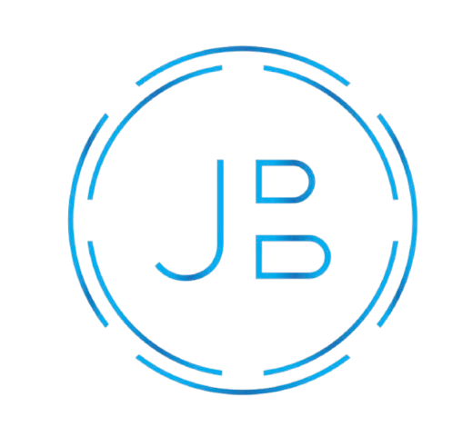

<!--Jeremy Bao's Profile Page-->

  <!-- Header text -->
  
  

  <ul align="center">
     
  </ul>
  

  
  <!-- Typing svg -->
  

    
  

  <!-- Badges  -->
  

    
  </a>
  
    
  

  <!-- Snake svg  -->
  

    
  

  
           

<!-- General Information -->
   ## **About me**
   - 👩‍💻 I am passionate about **optimizing machine learning for speed and size restrictions in practice!.**
   - 🔭 Currently working on v2 of *MonoNav: MAV Navigation via Monocular Depth Estimation and Reconstruction*. **Right now, I'm leading the development of a robust depth estimation pipeline and implementing a real-time dense SLAM system.**
   - 🌱 Currently learning about **Bayesian Optimization and Space-Filling Designs**.
   - 👨‍💻 Some of my projects are showcased here, while the majority remain proprietary!
   - 📫 Feel free to reach out to me  **jeremy.bao@princeton.edu**.
   - 👥 Connect with me on **[LinkedIn](https://www.linkedin.com/in/jeremy-bao/).**

 

<h3 align="left">Languages and Tools:</h3>

 <!--end message -->

   

   
 
   

      Thank you for stopping by my GitHub profile! Explore my repositories and projects at your leisure. If you have questions, ideas, or would like to collaborate, don’t hesitate to get in touch.
    
   

